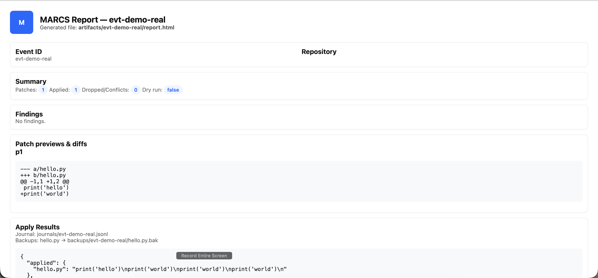
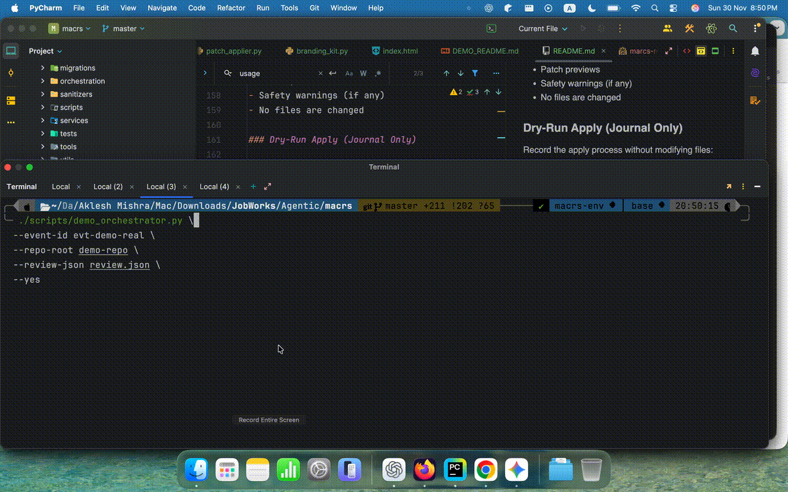

<div align="center">

# 🔵 MARCS
### Multi-Agent Code Review System

**Journaled • LLM-Assisted • Code Review**

<br/>


<br/>

[Baseline validation evidence](docs/baseline_integrity.md)
[](.)
[](LICENSE)
[](.)

<br/>

**MARCS is a multi-agent code review system that integrates LLM reasoning with journaled patch application and pattern-based safety analysis.**

</div>

---

## 🚀 Overview

MARCS is a research code review orchestrator with LLM integration, journaled patch application, recovery logic, safety scanning, and HTML artifact reporting. Production readiness has not been established.

Inspired by CI/CD systems, database recovery mechanisms, and multi-agent tooling — MARCS explores recovery and traceability for AI-driven code modification.

---

## 🎯 Use Cases

- Automated PR review for high-volume engineering teams
- Enterprise code quality pipelines
- Journaled LLM-generated patch application
- Security-aware code transformations
- Demo and mocked agent workflows; live LLM inference is not established as deterministic
- Research environment for multi-agent development workflows

---

## 🧰 Tech Stack

**Python · FastAPI · AsyncIO · Structured Logging · LLM Integration · Unified Diff Engine · JSONL Journaling**

---

## ✨ Key Features

- ✅ **Multi-Agent Reviewer** (LLM-backed or demo)
- ✅ **Journaled Patch Application** (journal + rollback + resume)
- ✅ **Demo/Fake LLM Modes** for local testing
- ✅ **Safety Engine** (detects eval/exec/os.system/shell=True/etc.)
- ✅ **Unified Diff Previews**
- ✅ **HTML Artifact Reports**
- ✅ **File Backups** for existing patch targets
- ✅ **Webhook Integration** (GitHub-compatible)
- ✅ **Automated Tests** — measured results and limits in [baseline evidence](docs/baseline_integrity.md)
- ✅ **Minimal Dependencies** & clean architecture
- ✅ **Structured Logging & Tracing** (trace IDs & spans)

---

## 📂 Project Structure

```
marcs/
├── api/                 # FastAPI routes & webhook handlers
├── core/                # Logging, tracing, env checks, reporting
├── orchestration/       # Orchestrator, safety engine
├── services/            # Reviewer + patch applier
├── worker/              # Async queue worker
├── journals/            # Journal source and runtime JSONL logs
├── backups/             # Automatic file backups
├── artifacts/           # HTML + JSON outputs
├── scripts/             # CLI tools & demos
└── tests/               # Automated tests (coverage not measured)
```

---

## 🖼️ HTML Report Preview

<div align="center">
  
  <p><em>Auto-generated HTML report with findings, patches, and safety warnings</em></p>
</div>

---

## 🧱 Architecture

```
             ┌──────────────────────┐
             │   GitHub Webhooks    │
             └──────────┬───────────┘
                        │
                 Normalization
                        ▼
             ┌──────────────────────┐
             │       Queue          │
             └──────────┬───────────┘
                        │
                 Worker (Async)
                        ▼
   ┌────────────────────────────────────────┐
   │           MARCS Orchestrator           │
   │                                        │
   │  • Runs Reviewer (LLM or Demo)         │
   │  • Generates Patch Suggestions         │
   │  • Safety Scan (eval/exec/etc)         │
   │  • Preview Rendering                   │
   │  • Journaled Patch Apply              │
   │  • Backup + Commit                     │
   │  • Artifact Writer (JSON + HTML)       │
   └────────────────────┬───────────────────┘
                        │
           Artifacts / Backups / Journal
                        ▼
     • artifacts/<event_id>/report.html  
     • journals/<event_id>.jsonl  
     • backups/<event_id>/filename.bak  
```

---

## 🏁 Quickstart

### Requirements

**Python 3.12.5 validated for the Slice 0 baseline**

macOS / Linux recommended

### 1. Install

```bash
python -m venv venv
source venv/bin/activate
python -m pip install -r requirements.txt
```

### 2. Initialize MARCS

```bash
bash scripts/init_macrs.sh
```

### 3. Create Demo Repository

```bash
mkdir demo-repo
echo "print('hello')" > demo-repo/hello.py
```

### 4. Create Review File (review.json)

```json
{
  "findings": [],
  "suggested_patches": {
    "hello.py": "--- a/hello.py\n+++ b/hello.py\n@@ -1,1 +1,2 @@\n print('hello')\n+print('world')\n"
  }
}
```

---

## 🖥️ Usage Examples

### Preview Only

```bash
./scripts/demo_orchestrator.py \
  --event-id evt-preview \
  --repo-root demo-repo \
  --review-json review.json \
  --preview-only
```

### Dry-Run Apply

```bash
./scripts/demo_orchestrator.py \
  --event-id evt-dry \
  --repo-root demo-repo \
  --review-json review.json \
  --yes \
  --dry-run
```

### Real Apply (Journaled Commit)

```bash
./scripts/demo_orchestrator.py \
  --event-id evt-real \
  --repo-root demo-repo \
  --review-json review.json \
  --yes
```

**Output example:**

```
[orchestrator] review_loaded_from_event
[orchestrator] apply_success → applied: hello.py
[orchestrator] report_generated → artifacts/evt-demo/report.html

✓ Patch application complete; inspect the journal and report.
```

---

## 🛡️ Safety Engine

**Detects:**

- `os.system()`
- `eval()`
- `exec()`
- `subprocess.run(..., shell=True)`
- Large patches (> 200 lines)
- Sensitive files (requirements.txt, setup.py, etc.)

**Warnings appear in:**

- CLI output
- `review.json`
- HTML report

---

## 🔄 Crash Recovery

```bash
python3 scripts/run_inspector.py --dry-run
python3 scripts/run_inspector.py
```

**Inspector can:**

- Resume partially applied operations
- Attempt rollback based on recorded backups and replacements
- Reject malformed JSONL records before recovery

---

## 🌐 Webhooks (GitHub-Compatible)

Send demo webhooks:

```bash
./scripts/send_webhook_demo.sh
```

**Outputs:**

- Normalized event
- Summary
- Priority
- Trace IDs

---

## 📁 Artifacts Produced

```
artifacts/<event_id>/
  ├── review.json
  ├── apply_result.json
  └── report.html

backups/<event_id>/
  └── *.bak

journals/
  └── <event_id>.jsonl
```

These artifacts support inspection of a run; they do not establish global reproducibility or recovery guarantees.

---

## 🧪 Tests

```bash
python -m pip install -r requirements-dev.txt
python -m pytest -q
```

See [Slice 0 baseline evidence](docs/baseline_integrity.md) for exact measured counts, dependency versions, and remaining limitations. Coverage was not measured. Run the offline baseline without live credentials or a local `.env`; the live reviewer smoke test skips when `OPENAI_API_KEY` is absent.

**Covers:**

- Patch conflict resolution
- Safety engine
- Resume/rollback
- HTML reports
- End-to-end orchestration
- Worker + queue
- Patch application

---

## 🎬 Demo (12s)

<div align="center">
  
</div>

---

## 🎨 Branding

Located in `data/marcs_branding_kit/`:

- `marcs-logo.svg`
- `marcs-mark.svg`
- `marcs-social-card.svg`
- `brand-guidelines.json`

**Style:**

- Primary — `#0b67ff`
- Accent — `#4cc1ff`
- Font — Inter / system-ui

---

## 🤝 Contributing

**Fork → Branch → Commit → Push → PR**

Contributions welcome!

1. Fork the repository
2. Create your feature branch (`git checkout -b feature/amazing-feature`)
3. Commit your changes (`git commit -m 'Add amazing feature'`)
4. Push to the branch (`git push origin feature/amazing-feature`)
5. Open a Pull Request

---

## 📄 License

MIT License — see [LICENSE](LICENSE).

---

## 👤 Author

**Aklesh Mishra**

AI/ML/GenAI Engineer • Multi-Agent Systems • LLM Infrastructure

- GitHub: [@Coder-12](https://github.com/Coder-12)
- Twitter: [@iminevitable10](https://x.com/iminevitable10)

---

<div align="center">

## ⭐ If MARCS impressed you, please star the repo!

**Built to explore journaled review and recovery workflows.**

Made with ❤️ for the future of AI-powered development tools.

</div>
