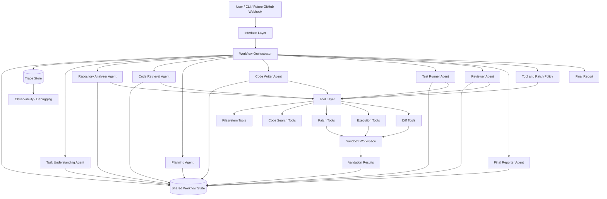
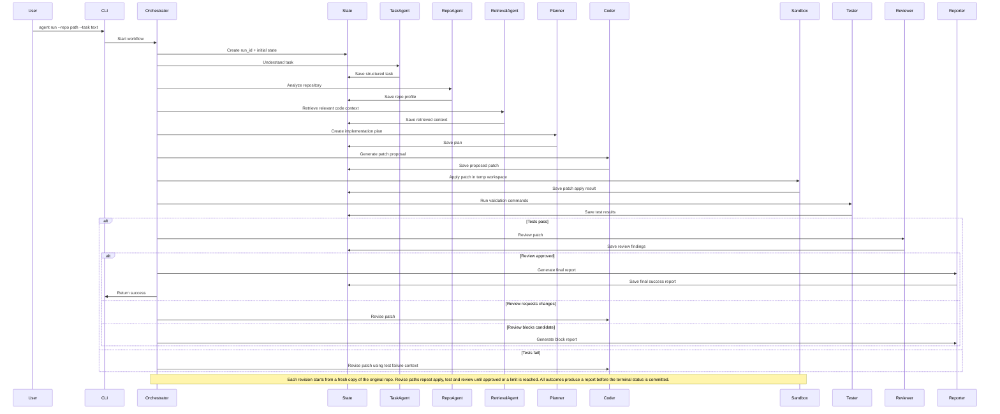
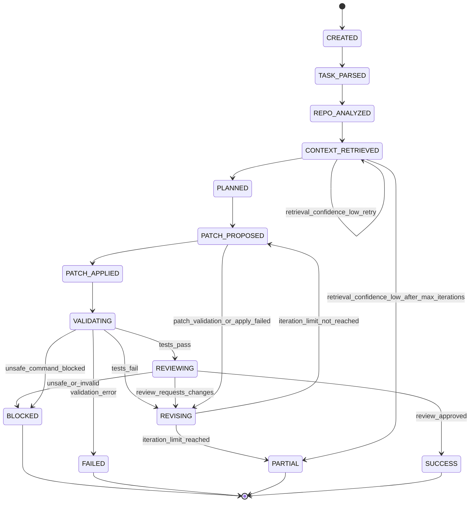
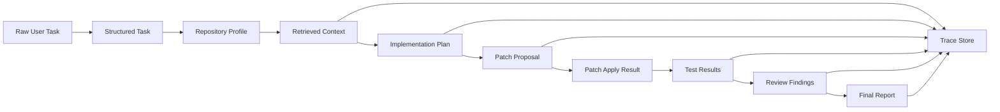
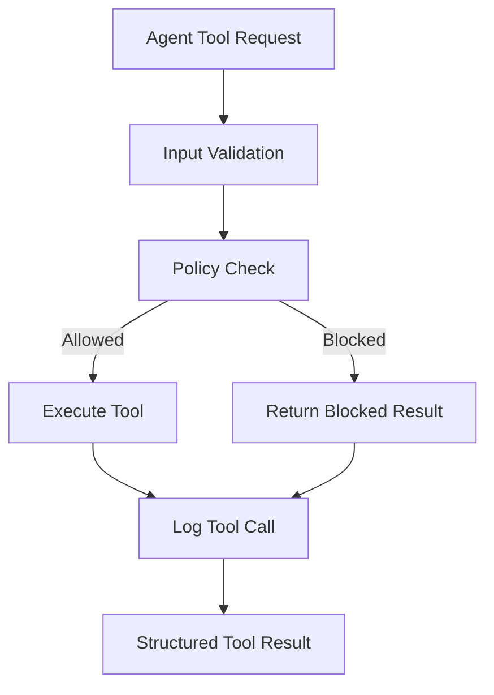
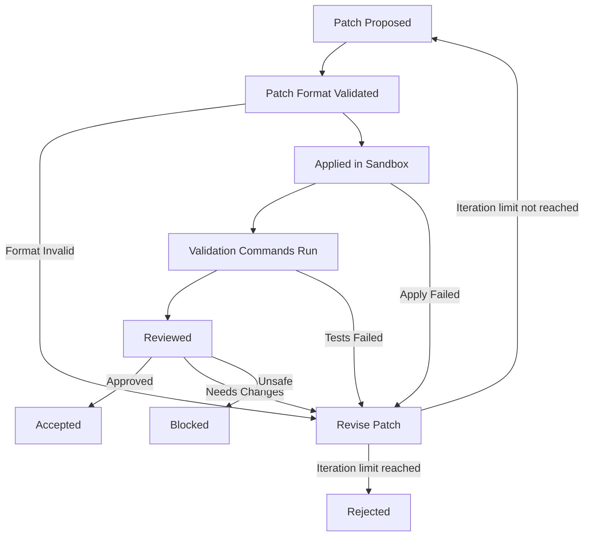
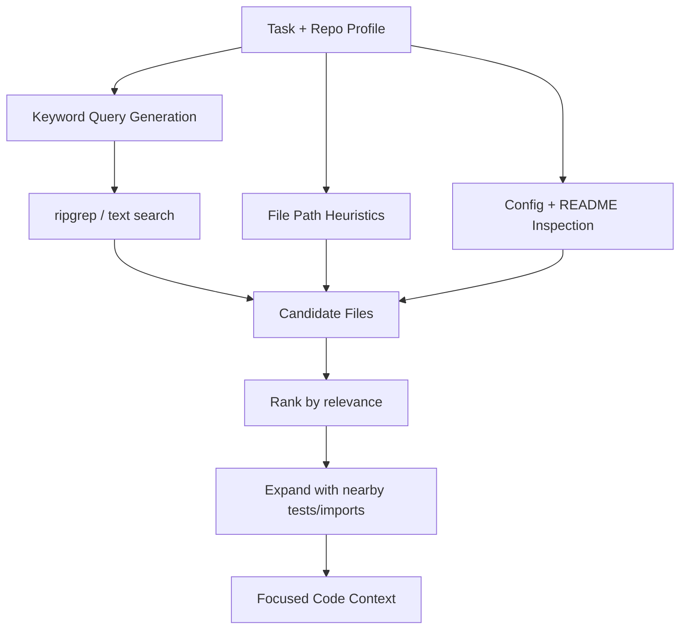
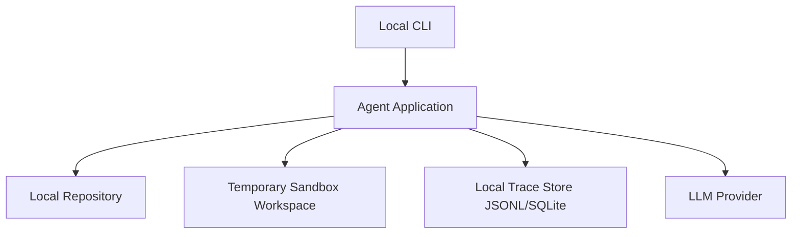
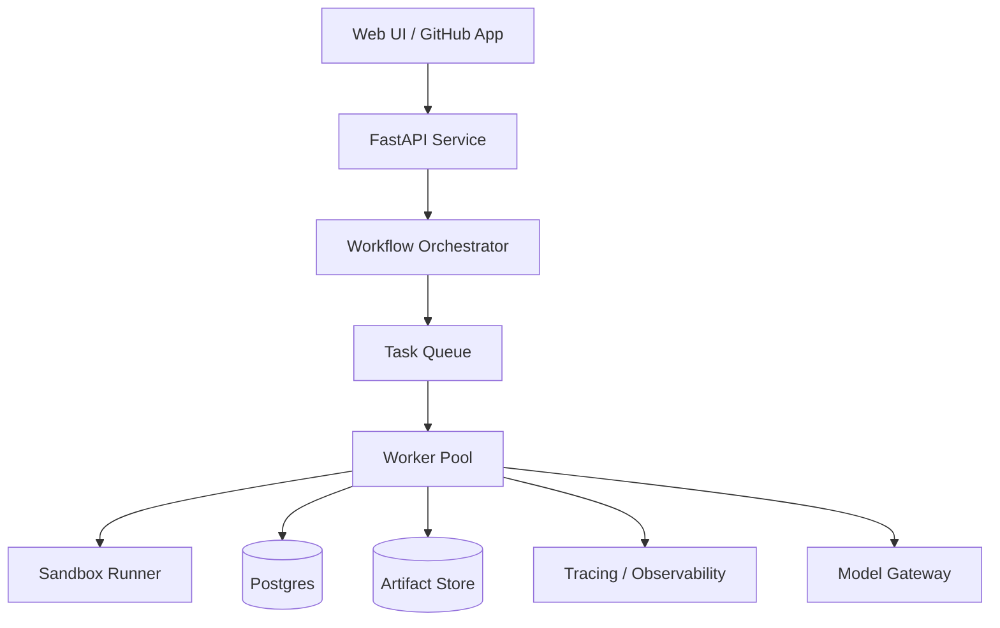

# Multi-Agent Software Engineering System — Design v1

> **Status:** Proposed target architecture for a task-to-patch system. This is not an as-built description of the current MARCS code review implementation. In the MVP, the named agents are logical modules in one controlled local workflow; they need not be separate processes or services.

## 1. Purpose

Build a production/research-grade multi-agent software engineering system that can take a natural language software task, understand a codebase, retrieve relevant context, plan changes, generate a patch, validate it with tests/static checks, review it, and produce a final PR-style report.

The goal is not just code generation. The goal is reliable, observable, testable, and recoverable AI-assisted software engineering.

---

## 2. Problem Statement

Current AI coding tools often fail because they:

- jump directly to implementation without sufficient repo understanding
- hallucinate APIs or file paths
- modify unrelated code
- do not validate changes properly
- lack review/security checks
- cannot recover cleanly from failures
- do not provide traceability of decisions

This system addresses those failures with controlled orchestration, strict tool contracts, shared state, temporary patch workspaces, validation loops, and evaluation.

---

## 3. MVP Scope

### In Scope

MVP will support:

- local Python repository
- natural language task input
- repository analysis
- code search/retrieval
- implementation planning
- patch generation
- sandbox patch application
- pytest execution
- diff generation
- review report
- final summary
- trace log for each run

### Out of Scope for MVP

Not building yet:

- GitHub webhook integration
- browser UI
- multi-language support
- distributed workers
- long-term memory
- full security scanner
- automatic PR creation
- autonomous production commits

---

## 4. Primary Workflow

```text
User Task
  ↓
Task Understanding
  ↓
Repository Analysis
  ↓
Code Retrieval
  ↓
Planning
  ↓
Patch Proposal
  ↓
Sandbox Patch Application
  ↓
Test Execution
  ↓
Review
  ↓
Final Report
```

Failure loops:

```text
Tests fail → Revise Patch → Re-run Tests
Review requests changes → Revise Patch → Re-run Tests and Review
Insufficient context → Retrieve More Context → Plan
```

---

## 5. Agents

### 5.1 Task Understanding Agent

Responsibility:

- classify task type
- extract goal
- identify constraints
- define success criteria

Output:

- structured task object

---

### 5.2 Repository Analyzer Agent

Responsibility:

- inspect repository structure
- identify language/framework
- detect test framework
- identify important directories
- summarize repo layout

Output:

- repo profile

---

### 5.3 Code Retrieval Agent

Responsibility:

- find relevant files/functions/tests
- use keyword search, file structure, and later AST/symbol search
- return focused context for planning/coding

Output:

- retrieved context chunks/files

---

### 5.4 Planning Agent

Responsibility:

- create implementation plan
- identify expected files to modify
- list validation commands
- state assumptions

Output:

- step-by-step plan

---

### 5.5 Code Writer Agent

Responsibility:

- generate minimal patch
- avoid unrelated changes
- follow existing code style
- explain assumptions

Output:

- proposed patch/diff

---

### 5.6 Test Runner Agent

Responsibility:

- run allowed validation commands against the sandbox candidate after the orchestrator applies the patch
- collect stdout/stderr/exit codes
- classify test result

Output:

- test result object

---

### 5.7 Reviewer Agent

Responsibility:

- review patch for correctness, maintainability, style, and risk
- detect unrelated edits
- recommend approve/revise/block

Output:

- review findings

---

### 5.8 Final Reporter Agent

Responsibility:

- produce final PR-style summary
- include changed files, tests run, risks, assumptions, and status

Output:

- final report

---

## 6. Tool Contracts

MVP tools:

```text
list_files(repo_path) -> FileTree
read_file(repo_path, relative_path) -> FileContent
search_code(repo_path, query) -> SearchResults
create_sandbox(repo_path) -> SandboxWorkspace
apply_patch_sandbox(sandbox_path, patch) -> PatchApplyResult
run_command(sandbox_path, validated_argv) -> CommandResult
get_diff(original_repo_path, sandbox_path) -> Diff
dispose_sandbox(sandbox_path) -> CleanupResult
write_trace(run_id, event) -> TraceResult
```

The Code Writer Agent returns a patch proposal; `propose_patch` is an agent action, not a deterministic tool. The orchestrator creates a fresh sandbox from the original repository for each patch iteration and disposes of rejected candidates. Every run returns its terminal report; an accepted candidate also returns its diff. The MVP never applies it to the original repository.

Rules:

- agents cannot directly mutate files
- all edits go through patch proposal
- patch is applied only in controlled workspace
- shell commands must be allowlisted
- every tool call must be logged

---

## 7. Shared State Schema

```json
{
  "run_id": "string",
  "task": {
    "raw_input": "string",
    "task_type": "bug_fix | feature | refactor | test | docs | unknown",
    "goal": "string",
    "constraints": [],
    "success_criteria": []
  },
  "repo_profile": {
    "language": "string",
    "framework": "string",
    "test_framework": "string",
    "important_dirs": []
  },
  "retrieved_context": [],
  "plan": {
    "steps": [],
    "files_to_inspect": [],
    "files_to_modify": [],
    "validation_commands": [],
    "assumptions": []
  },
  "patches": [],
  "patch_apply_results": [],
  "test_results": [],
  "review_findings": [],
  "policy_findings": [],
  "iteration_count": 0,
  "final_status": "pending | success | failed | blocked | partial",
  "final_report": ""
}
```

The pipe-separated `final_status` value above documents allowed values; an implementation uses a single enum value. `PARTIAL` is defined in Sections 14 and 31.

---

## 8. Safety Rules

Mandatory:

- no direct blind file mutation
- patch-first editing only
- sandbox patch application
- command allowlist
- max iteration limit
- discard the sandbox candidate on a failed patch
- block dangerous commands
- log all decisions and tool calls
- final report must mention uncertainty/assumptions

Command allowlist for MVP:

```text
pytest
python -m pytest
ruff
mypy
```

Diff generation is an internal read-only tool operation, not a task-supplied validation command.

Blocked examples:

```text
rm -rf
sudo
curl unknown URLs
ssh
scp
chmod 777
cat .env
printenv
```

---

## 9. Evaluation Goals

MVP evaluation will measure:

### Functional Success

- did the patch apply?
- did tests pass?
- did the system complete the workflow?

### Patch Quality

- minimal diff
- no unrelated changes
- readable implementation
- follows project style

### Retrieval Quality

- did it retrieve the correct files?
- did it miss key context?

### Agent Workflow Quality

- did planning happen before coding?
- were unnecessary loops avoided?
- were failures handled clearly?

### Operational Metrics

- number of LLM calls
- latency per stage
- total runtime
- failed tool calls
- retry count

---

## 10. MVP Acceptance Criteria

MVP is considered complete when:

- user can run the system from CLI
- system accepts a repo path and task
- system analyzes repo structure
- system retrieves relevant files
- system creates a plan
- system proposes a patch
- system applies patch in a fresh sandbox candidate
- system runs tests
- system produces final report
- system stores a trace log
- failure cases are reported cleanly
- original repository remains unchanged, including on success

---

## 11. Future Phases

### Phase 2

Strengthen the logical agent contracts, add AST/symbol retrieval, and add a dedicated Debugging Agent. The MVP already has the agents listed in Section 5 as modules in a single orchestrated process.

### Phase 3

Expand the MVP's bounded feedback loops with richer diagnosis:

- test failure analysis with a dedicated Debugging Agent
- reviewer feedback targeted to specific patch edits
- retrieval reranking based on failure evidence
- hybrid semantic retrieval and historical patch memory

### Phase 4

Add stronger safety:

- Docker sandbox
- command policy engine
- security scanner
- secret detection

### Phase 5

Add benchmark suite:

- bug fix tasks
- test generation tasks
- refactor tasks
- security tasks

### Phase 6

Add GitHub integration:

- issue-to-patch
- PR review comments
- CI integration

---

## 12. Full System Architecture

The system is designed as a controlled multi-agent software engineering workflow engine.

It is intentionally separated into:

1. Interface layer
2. Orchestration layer
3. Agent layer
4. Tool execution layer
5. Sandbox / workspace layer
6. State + tracing layer
7. Evaluation layer

The core design principle is:

> Agents reason, tools act, orchestrator controls, state records, temporary workspaces preserve the source, evaluation verifies.

---

### 12.1 High-Level Architecture Diagram



---

### 12.2 Layer Responsibilities

#### 12.2.1 Interface Layer

Responsible for accepting user input.

MVP interface:

```bash
agent run --repo ./sample_repo --task "Fix failing login test"
```

Future interfaces:

- GitHub issue webhook
- GitHub PR review webhook
- REST API
- simple dashboard

The interface should not contain business logic.
It only validates user input and starts a workflow run.

---

#### 12.2.2 Orchestration Layer

The orchestrator is the control plane.

Responsibilities:

- decide agent execution order
- pass shared state between agents
- enforce max iterations
- trigger retries
- stop unsafe workflows
- route failures to debugging/revision
- produce final workflow status

The orchestrator owns the workflow.

Agents do not call each other directly.

Correct:

```text
Orchestrator → Agent → State Update → Orchestrator decides next step
```

Incorrect:

```text
Agent A → Agent B → Agent C freely
```

This makes the system more debuggable, testable, and production-safe.

---

#### 12.2.3 Agent Layer

Agents are reasoning modules with narrow responsibilities.

Each agent must have:

```text
Input schema
Output schema
Allowed tools
Failure behavior
Trace logging
```

Agents in MVP:

```text
Task Understanding Agent
Repository Analyzer Agent
Code Retrieval Agent
Planning Agent
Code Writer Agent
Test Runner Agent
Reviewer Agent
Final Reporter Agent
```

Agents added later:

```text
Debugging Agent
Security Agent
Documentation Agent
Performance Agent
Dependency Analysis Agent
```

---

#### 12.2.4 Tool Layer

Tools are deterministic execution units.

Agents should not directly access filesystem, shell, or Git.

They must use tools.

MVP tools:

```text
list_files
read_file
search_code
create_sandbox
apply_patch_sandbox
run_command
get_diff
dispose_sandbox
write_trace
```

Tool layer responsibilities:

- validate inputs
- enforce permissions
- apply command allowlist
- return structured output
- never hide errors
- log every operation

---

#### 12.2.5 Sandbox Workspace Layer

All patch application and test execution happen in a fresh temporary copy of the repository for each candidate patch.

Patch tools never write to the original repository.

Workflow:

```text
Original Repo
   ↓ copy
Sandbox Workspace
   ↓ apply patch
Run tests/checks
   ↓
Accept / Reject
```

This keeps system patch writes off the original repository and makes rejected candidates disposable.

The MVP workspace is a temporary directory, not an isolation boundary for untrusted code. See Section 24.6.

Later sandbox can become:

- Docker container
- firejail/nsjail
- restricted execution environment
- remote worker

---

#### 12.2.6 Shared State Layer

The shared state is the single source of truth for one workflow run.

It stores:

```text
task understanding
repo profile
retrieved context
plan
patches
test results
review findings
policy findings
iteration count
final status
final report
```

This enables:

- debugging
- replay
- evaluation
- observability
- failure analysis

---

#### 12.2.7 Trace / Observability Layer

Every run should produce a trace.

Trace events include:

```text
workflow_started
agent_started
agent_completed
tool_called
tool_failed
patch_proposed
patch_applied
tests_started
tests_completed
review_completed
workflow_partial
workflow_blocked
workflow_failed
workflow_succeeded
```

Each trace event should include:

```text
run_id
timestamp
stage
agent/tool name
input summary
output summary
latency
status
error if any
```

This is critical for production-grade debugging.

---

#### 12.2.8 Evaluation Layer

Evaluation is not part of the runtime path initially, but it is part of the project architecture.

Evaluation will measure:

```text
task success rate
test pass rate
patch apply rate
retrieval correctness
plan quality
review usefulness
failure recovery rate
cost per run
latency per stage
number of iterations
```

Later, benchmark tasks will be run through the same workflow to compare versions.

---

## 13. End-to-End Workflow Sequence



---

### 13.1 Important Workflow Rule

No patch should be accepted only because the LLM says it is correct.

A patch is accepted only when:

```text
patch applies cleanly
AND validation commands complete successfully
AND reviewer approves
AND tool and patch policy checks do not block
```

For MVP, this means:

```text
patch applies cleanly
AND pytest/selected checks pass
AND reviewer gives an approve decision
AND tool and patch policy checks do not block
```

---

## 14. Runtime State Machine



The diagram shows the main candidate path. Invalid repo, agent/schema/tool errors, and other hard failures can transition from their active stage to `FAILED`; policy violations can transition to `BLOCKED`. Before committing any terminal status, the orchestrator writes the applicable report and minimum artifacts from Section 31.5. `SUCCESS` means the sandbox candidate was accepted for delivery, not that the original repository was modified.

---

### 14.1 Terminal States

```text
SUCCESS:
The candidate patch applied in the sandbox, tests passed, review approved, and the final report and diff were generated. The original repository remains unchanged.

FAILED:
The system encountered a hard error (invalid repo, tool failure, schema error, or unrecoverable validation error).

BLOCKED:
The system stopped because of safety, security, or policy violation.

PARTIAL:
The system ran correctly but could not converge to an accepted patch within limits. Produces a diagnostic report (see Section 31).
```

---

## 15. Data Flow Architecture



---

### 15.1 Data Quality Requirements

At every stage, outputs must be structured.

Bad:

```text
"I think the repo uses pytest and probably auth.py is relevant."
```

Good:

```json
{
  "test_framework": "pytest",
  "evidence": [
    "pyproject.toml contains pytest config",
    "tests/ directory exists"
  ],
  "relevant_files": ["src/auth/session.py", "tests/test_session.py"]
}
```

Structured outputs make the system testable and debuggable.

---

## 16. Component Design

### 16.1 Core Components

```text
 src/
  agents/
    task_understanding.py
    repo_analyzer.py
    code_retriever.py
    planner.py
    code_writer.py
    test_runner.py
    reviewer.py
    final_reporter.py

  orchestrator/
    workflow.py
    state_machine.py
    policies.py

  tools/
    filesystem.py
    search.py
    patch.py
    shell.py
    diff.py

  schemas/
    task.py
    repo.py
    retrieval.py
    plan.py
    patch.py
    validation.py
    review.py
    workflow.py

  llm/
    client.py

  cli.py

  prompts/
    (versioned prompt files, see Section 28.3)

  tracing/
    logger.py
    trace_store.py

  config/
    schema.py
    settings.py
```

This is the proposed package layout for the target system, not a map of the existing MARCS repository.

---

### 16.2 Dependency Direction

```text
CLI/API
  depends on → orchestrator

orchestrator
  depends on → agents, schemas, tracing, policies

agents
  depend on → schemas, tools

tools
  depend on → standard libraries / external binaries

schemas
  depend on → pydantic only

tracing
  depends on → schemas / storage
```

Important rule:

```text
Tools must not depend on agents.
Schemas must not depend on agents.
Agents must not control the workflow.
The orchestrator controls workflow transitions.
```

This keeps the architecture clean.

---

## 17. Agent Contract Design

Every agent follows the same contract:

```text
AgentInput -> Agent -> AgentOutput
```

Every agent must return:

```json
{
  "status": "success | failed | blocked",
  "output": {},
  "confidence": 0.0,
  "assumptions": [],
  "evidence": [],
  "errors": []
}
```

---

### 17.1 Agent Design Rules

Agents should:

- have narrow responsibility
- produce structured output
- cite files/functions used as evidence
- avoid direct side effects
- fail clearly when context is insufficient
- never silently ignore tool errors
- include assumptions explicitly

Agents should not:

- mutate files directly
- call arbitrary shell commands
- skip planning
- approve their own patch
- hide uncertainty
- claim tests passed unless tool output confirms it

---

## 18. Tool Safety Architecture



---

### 18.1 Command Execution Policy

Validation execution must go through a command policy engine. It accepts an argument vector, not a shell command string; it must never invoke a shell. It validates the executable, subcommand, flags, and file targets against the configured policy, sets the working directory to the sandbox, and records exit status, output, and timeouts. Task text or repository content cannot expand the allowlist. Even these commands can execute repository code, so the MVP is limited to trusted local repositories (Section 24.6).

Allowed MVP commands:

```text
pytest
python -m pytest
ruff
mypy
```

`get_diff` is an internal comparison tool, not an allowlisted command submitted by an agent or task. It compares the original and candidate snapshots without invoking a shell.

Conditionally allowed later:

```text
npm test
go test
cargo test
python -m unittest
```

Blocked commands:

```text
rm -rf
sudo
ssh
scp
curl
wget
chmod 777
printenv
cat .env
docker run --privileged
```

---

### 18.2 File Mutation Policy

Allowed:

```text
apply validated patch inside sandbox
write trace files
write generated report
```

Blocked:

```text
direct overwrite of arbitrary files
delete repository files without explicit approval
modify .env or secrets files
modify git history
push to remote
```

The tool layer also rejects absolute paths, `..` traversal, and symlink escapes for reads and writes. It blocks reads and writes of secret patterns (`.env`, `secrets.*`, `*.key`, `*.pem`) and excludes `.git` and run artifacts from retrieved context. It checks the resolved target path before accessing it. Trace and report output lives outside the candidate repository.

---

## 19. Patch Lifecycle



`Rejected` maps to the workflow's `PARTIAL` terminal state after a diagnostic report is written. A policy-blocked candidate maps to `BLOCKED`.

---

### 19.1 Patch Acceptance Rules

A patch can be accepted only if:

```text
patch format is valid
patch applies cleanly in sandbox
validation commands pass
reviewer approves
no safety policy blocks it
```

A patch must be rejected or revised if:

```text
it modifies unrelated files
it fails tests
it introduces unsafe behavior (block if policy forbids it)
it lacks required test coverage
it breaks public API unexpectedly
it contains unexplained large changes
```

---

## 20. Retrieval / Code Understanding Architecture

Code retrieval should not rely only on embeddings.

MVP retrieval:

```text
file tree scan
keyword search
path heuristics
test file detection
README/config inspection
```

Phase 2 retrieval:

```text
AST summaries
symbol search
import graph
function/class index
dependency-aware expansion
```

Phase 3 retrieval:

```text
embedding-based semantic search
hybrid retrieval
call graph traversal
historical patch memory
```

---

### 20.1 Code Retrieval Flow



---

### 20.2 Retrieval Quality Principle

For code tasks, the system should retrieve:

```text
implementation file
related test file
interface/schema/config file if relevant
```

A code patch should usually not be generated if no relevant implementation file is retrieved. Test-only and documentation tasks can instead proceed from the relevant test or documentation context.

---

## 21. Failure Handling Design

The system must treat failures as first-class events.

Common failure types:

```text
repo_not_found
unsupported_language
insufficient_context
patch_generation_failed
patch_apply_failed
test_command_failed
tests_failed
review_blocked
unsafe_command_blocked
iteration_limit_reached
tool_timeout
```

---

### 21.1 Failure Response Strategy

| Failure                 | Response                                  |
| ----------------------- | ----------------------------------------- |
| Repo path invalid       | stop with clear error                     |
| Unsupported repo        | produce repo profile + explain limitation |
| Insufficient context    | retrieve more context                     |
| Patch apply failed      | revise patch                              |
| Tests failed            | route to debugging/revision               |
| Unsafe command          | block immediately                         |
| Review requests changes | revise if an attempt remains             |
| Review or policy blocked | stop as BLOCKED                           |
| Iteration limit reached | stop with diagnostic report               |
| Tool timeout            | retry once, then fail cleanly             |

---

### 21.2 Max Iteration Rule

MVP limit:

```text
max_patch_iterations = 2
max_retrieval_iterations = 2
max_test_runs = 3
```

These are total attempts, including the first attempt. Each patch iteration starts from a fresh original-repo copy; there are at most two patch proposals and at most three validation batches across the run. One batch runs all selected validation commands for one candidate; the extra allowance covers a transient execution retry. When a limit prevents further progress, the run ends as `PARTIAL`. Hard tool failures end as `FAILED`, and policy violations end as `BLOCKED`.

---

## 22. Research-Grade Evaluation Design

The project should evaluate both final output and internal trajectory.

---

### 22.1 Runtime Metrics

```text
task_completion_status
patch_apply_success
test_pass_status
review_status
number_of_iterations
number_of_tool_calls
latency_total
latency_by_stage
tokens_by_agent
cost_estimate
```

---

### 22.2 Quality Metrics

```text
task_success_rate
patch_minimality
unrelated_change_rate
retrieval_recall
expected_file_hit_rate
test_pass_rate
review_precision
security_block_rate
self_correction_success_rate
```

---

### 22.3 Benchmark Dataset

Initial benchmark:

```text
20 tasks total

5 bug fixes
5 test generation tasks
4 refactor tasks
3 security fixes
3 documentation/config tasks
```

Each benchmark task should define:

```json
{
  "task_id": "bug_001",
  "repo": "sample_fastapi_app",
  "task": "Fix inactive user token refresh bug",
  "expected_files": ["src/auth/tokens.py", "tests/test_token_refresh.py"],
  "validation_commands": ["pytest tests/test_token_refresh.py"],
  "difficulty": "medium",
  "success_criteria": [
    "inactive users cannot refresh token",
    "existing active user refresh flow still works"
  ]
}
```

---

### 22.4 Research Experiments

Important experiments:

```text
single-agent vs multi-agent workflow
keyword retrieval vs AST retrieval
planner-first vs direct coding
with reviewer vs without reviewer
with test feedback loop vs without loop
small model vs strong model for reviewer
```

This makes the project research-grade, not just implementation-grade.

---

## 23. Deployment / Production View

The proposed MVP runs locally as a CLI.



Future production deployment:



---

### 23.1 Future Production Components

```text
FastAPI backend
Postgres run store
Redis queue
worker pool
Docker sandbox runner
artifact storage
GitHub App integration
trace dashboard
model gateway
rate limiter
tenant/auth layer
```

MVP should be designed so these can be added later without rewriting everything.

---

## 24. Supporting Design Decisions

The following decisions complete the proposed target architecture.

### 24.1 Model Provider Abstraction

Do not hardcode one model.

Design:

```text
LLMClient
  - generate_structured()
  - generate_text()
```

Streaming is a later extension; the MVP interface consists of the two methods specified in Section 25.1.

Provider adapters:

```text
MVP: OpenAI and mock model for tests
Later: Anthropic and local model
```

Why this matters:

- easier testing
- cheaper experimentation
- fallback models
- provider independence

---

### 24.2 Prompt Versioning

Every agent prompt should have a version.

Example:

```text
planner_v1
reviewer_v1
code_writer_v1
```

Trace should store:

```text
agent_name
prompt_version
model
temperature
input_hash
output_hash
```

This is important for reproducibility.

---

### 24.3 Config Management

Use a config file or environment-based settings.

Example:

```yaml
max_patch_iterations: 2
max_retrieval_iterations: 2
max_test_runs: 3
allowed_commands:
  - pytest
  - python -m pytest
  - ruff
  - mypy
sandbox_mode: tempdir
trace_backend: jsonl
model_provider: openai
```

Avoid hardcoded constants inside business logic.

---

### 24.4 Artifact Management

Every run saves the shared state and trace:

```text
runs/{run_id}/state.json
runs/{run_id}/trace.jsonl
```

The run also saves the terminal report and any diff or test output that exists. Section 31.5 defines the file set for each outcome.

---

### 24.5 Human Approval Checkpoint

For MVP this can be optional.

Later:

```text
Plan approval before patch
Patch approval before applying to real repo
Review approval before final acceptance
```

This makes the system practical for real engineering usage.

---

### 24.6 Security Boundary

The system should clearly state:

```text
MVP uses a temporary workspace, not a security sandbox or process isolation.
Patch tools write only to that workspace, but validation commands still run with the user's OS permissions and may access files outside it.
Do not run untrusted repositories in MVP.
Docker isolation will be added in a later phase.
```

The integration test checks that the source fixture remains unchanged. This is a workflow guarantee for trusted code, not a security guarantee against code executed by validation.

---

### 24.7 Test Strategy for the System Itself

We need tests for our own system:

```text
schema validation tests
tool policy tests
command allowlist tests
patch apply tests
workflow state transition tests
trace writing tests
failure handling tests
```

This prevents our agent system from becoming fragile.

---

## 25. LLM Interaction Layer

The LLM interaction layer sits between agents and the model provider.
Agents never call the LLM directly.
They always go through the `LLMClient`.

---

### 25.1 LLMClient Interface

```python
class LLMClient:
    def generate_structured(
        self,
        system_prompt: str,
        user_message: str,
        output_schema: type[BaseModel],
        agent_name: str,
        prompt_version: str,
    ) -> BaseModel: ...  # instance of output_schema

    def generate_text(
        self,
        system_prompt: str,
        user_message: str,
        agent_name: str,
        prompt_version: str,
    ) -> str: ...
```

Rules:

- `generate_structured` is the primary method for LLM-backed agents.
- `generate_text` is only used for final report generation (free-form markdown).
- Agents must not construct raw API calls.
- All calls must pass `agent_name` and `prompt_version` for tracing.
- The client returns a validated schema instance or raises a typed `LLMError`. The agent wraps success or failure in its `AgentOutput` contract (Section 17).

---

### 25.2 Structured Output Enforcement

Use provider-level structured output where available, then validate it locally against the Pydantic schema. A provider without that feature may return text, but local schema validation is still mandatory.

MVP approach:

```text
Use JSON mode / response_format=json_object where supported.
Include explicit output schema in the system prompt.
Instruct the model: "Respond ONLY with a valid JSON object matching this schema. No preamble. No explanation."
Validate returned JSON against the Pydantic schema before returning.
```

If provider-level structured output is not available:

```text
Wrap the output schema in the system prompt using a clear XML/JSON block instruction.
Parse a single JSON object from the response; reject ambiguous or extra content.
Validate with the Pydantic schema.
```

Validation failure triggers a retry (see Section 25.3).

---

### 25.3 Retry Policy

LLM calls can fail in two ways:

```text
API error       → network/provider failure
Schema error    → model returned malformed or invalid output
```

Retry rules:

```text
max_retries_api_error   = 3
max_retries_schema_error = 2
backoff                 = exponential (1s, 2s, 4s)
```

On exhausted retries:

```text
LLMClient raises a typed LLMError with the cause and attempt count.
The calling agent catches it and returns AgentOutput with status = "failed" and error details.
The orchestrator handles that failed agent output through the state machine.
```

`max_retries_*` counts retries after the initial attempt. Use exponential backoff for retriable provider errors; invalid schema responses use the schema retry limit.

---

### 25.4 Context Window Management

Code retrieval returns potentially large context.
Agents have token budgets.

MVP budget policy:

```text
Task Understanding Agent    → low context needed    → 2K tokens input budget
Repository Analyzer Agent   → medium                → 4K tokens input budget
Code Retrieval Agent        → medium                → 4K tokens input budget
Planning Agent              → medium-high           → 8K tokens input budget
Code Writer Agent           → high                  → 16K tokens input budget
Reviewer Agent              → high                  → 16K tokens input budget
Final Reporter Agent        → medium                → 8K tokens input budget
```

If retrieved context exceeds an LLM-backed agent's budget:

```text
Keep matched lines and the containing function or class before trimming less relevant context.
Prefer interfaces and directly related tests; include a short test file in full only when it fits the remaining budget.
If essential code or tests cannot fit, return insufficient context and retrieve a narrower slice instead of generating a patch from incomplete evidence.
Log truncation event in trace.
```

This policy must be enforced in the context injection step before each LLM call.
Token budgets and temperatures apply only to stages that use an LLM; the tool-based Test Runner does not make a model call.

---

### 25.5 Temperature Policy

Different agents require different sampling behavior:

```text
Task Understanding Agent    → temperature = 0.0   (deterministic classification)
Repository Analyzer Agent   → temperature = 0.0   (deterministic analysis)
Code Retrieval Agent        → temperature = 0.0   (deterministic ranking)
Planning Agent              → temperature = 0.1   (slightly creative but mostly deterministic)
Code Writer Agent           → temperature = 0.2   (controlled creativity for implementation)
Reviewer Agent              → temperature = 0.0   (deterministic evaluation)
Final Reporter Agent        → temperature = 0.3   (readable prose generation)
```

Temperature values must be stored in config and referenced per-agent, not hardcoded.

---

### 25.6 Tracing LLM Calls

Every LLM call must write to the trace store with:

```json
{
  "event": "llm_call",
  "run_id": "string",
  "agent_name": "string",
  "prompt_version": "string",
  "model": "string",
  "temperature": 0.0,
  "input_token_count": 0,
  "output_token_count": 0,
  "latency_ms": 0,
  "status": "success | schema_error | api_error",
  "retry_count": 0
}
```

This is the foundation for cost tracking, latency analysis, and debugging prompt regressions.

---

## 26. Patch Format Specification

A patch is the unit of proposed change produced by the Code Writer Agent and consumed by the sandbox layer.

---

### 26.1 Patch Structure

MVP patch format is a structured JSON object, not a raw unified diff.

Reason: unified diffs are fragile to line number drift and hard for LLMs to produce reliably.
The system derives a unified diff from the original and candidate files for display and artifacts only.

```json
{
  "patch_id": "string",
  "run_id": "string",
  "iteration": 1,
  "files": [
    {
      "path": "src/auth/tokens.py",
      "operation": "modify",
      "original_sha256": "sha256-of-original-file",
      "original_snippet": "def refresh_token(user):\n    return generate_token(user)",
      "replacement_snippet": "def refresh_token(user):\n    if not user.is_active:\n        raise InactiveUserError()\n    return generate_token(user)",
      "justification": "Add inactive user guard before token generation."
    }
  ],
  "assumptions": [],
  "risks": []
}
```

Allowed operations:

```text
modify   → replace a unique, exact snippet in an existing file
create   → create a new file with given content
```

Rules:

```text
One patch per iteration.
One patch object covers all files changed in that iteration.
delete is not an MVP operation; it requires a later policy and approval design.
For `modify`, require `original_sha256`, `original_snippet`, and `replacement_snippet`. The snippet must occur exactly once in the original file.
For `create`, require `content` and a path that does not exist in the original repository. Do not send modify-only fields.
All paths are repository-relative paths to UTF-8 text files. Binary files are out of MVP scope.
```

---

### 26.2 Patch Validation Steps

Before applying in sandbox, the tool layer must validate:

```text
1. patch_id and run_id are present
2. all file paths are within the repo boundary (no path traversal)
3. operation is `modify` or `create`, with its required fields
4. each path is unique in the patch and resolves within the sandbox without a symlink escape
5. for `modify`, file hash matches `original_sha256` and `original_snippet` occurs exactly once
6. for `create`, the path does not already exist; content is a string (including an empty string when intended)
7. no file in the patch matches the blocked file list (.env, secrets.*, *.key, *.pem)
```

If any step fails:

```text
Return PatchApplyResult with status = "validation_failed"
Include which validation step failed
Do not proceed to sandbox application
```

---

### 26.3 Patch Application in Sandbox

```text
1. Create a fresh tempdir copy of the original repo for this iteration; keep the original read-only.
2. Validate the entire patch before changing any candidate file.
3. Apply every operation to the candidate: replace the unique snippet for `modify`, or write `content` for `create`.
4. Compare candidate files with the original snapshot immediately after application to produce a unified diff, including new files. Later files generated by validation do not enter the patch diff.
5. Store that diff as `runs/{run_id}/patch.diff` for the current attempt and return `PatchApplyResult`.
```

```json
{
  "status": "success | validation_failed | apply_failed",
  "sandbox_path": "string",
  "unified_diff": "string",
  "files_modified": [],
  "error": null
}
```

---

### 26.4 Candidate Disposal

If patch application, tests, or review rejects a candidate:

```text
Record the attempted diff if generated and any diagnostic output, then dispose of the sandbox workspace.
For a revisable finding, state moves to REVISING if an attempt remains. For a policy block, state moves to BLOCKED. On exhausted attempts, state moves to PARTIAL.
Original repo is never touched.
```

`dispose_sandbox` is cleanup, not a rollback of the original repository. The candidate is disposable.

---

## 27. Code Retrieval Specification

This section pins the MVP retrieval implementation so the Code Retrieval Agent can be built without ambiguity.

---

### 27.1 MVP Retrieval Tools

```text
Primary:   ripgrep (rg) for keyword search — fast, regex-aware, respects .gitignore
Secondary: file tree scan via os.walk / pathlib
Tertiary:  README + config file inspection (pyproject.toml, setup.cfg, setup.py)
```

ripgrep must be present in the execution environment.
If unavailable, fall back to a bounded Python standard-library text scan over eligible repository files.
Log which tool was used in the trace.

---

### 27.2 Query Generation

The Code Retrieval Agent generates search queries from the structured task object.

Inputs:

- `task.goal`
- `task.task_type`
- `repo_profile.important_dirs`

Query generation rules:

```text
Extract key nouns and function-like terms from task.goal.
Generate 3–5 keyword queries.
Avoid stop words (the, a, is, for).
Include task_type-specific hints:
  bug_fix   → error, exception, fail, raise, assert
  feature   → add, create, implement, new
  refactor  → rename, extract, move, split
  test      → test_, fixture, mock, assert
```

Example:

```text
Task: "Fix inactive user token refresh bug"

Queries:
  refresh_token
  inactive user
  is_active
  token
  InactiveUser
```

---

### 27.3 Candidate File Ranking

After ripgrep returns results, rank candidate files:

```text
Score each file as:
  +3 if filename contains a keyword from queries
  +2 if file is in important_dirs
  +2 if file is a direct match to task noun (e.g. "token" → tokens.py)
  +1 per matching line found by ripgrep
  +1 if a corresponding test file exists (tests/test_<filename>.py)
  -1 if file is in: migrations/, __pycache__/, .git/, build/, dist/
```

Return top 5 files by score.

---

### 27.4 Context Expansion

For each top-ranked file, expand context:

```text
Include up to 300 relevant lines from a matched file, preserving matched lines and their containing function or class.
Look for a co-located test file: tests/test_<filename>.py or test_<filename>.py.
Include the test file in full if under 200 lines.
If the file imports a module relevant to the task, add that module's interface (top 50 lines).
```

---

### 27.5 Retrieval Output Schema

```json
{
  "retrieved_files": [
    {
      "path": "src/auth/tokens.py",
      "score": 8,
      "content": "...",
      "truncated": false,
      "reason": "keyword match: refresh_token, is_active"
    }
  ],
  "test_files": [
    {
      "path": "tests/test_tokens.py",
      "content": "..."
    }
  ],
  "retrieval_queries": ["refresh_token", "inactive user", "is_active"],
  "files_searched": 142,
  "retrieval_tool": "ripgrep",
  "retrieval_confidence": "sufficient"
}
```

---

### 27.6 Insufficient Context Rule

If the top-ranked file score is below threshold (score < 3):

```text
Mark retrieval result as: retrieval_confidence = "low"
Orchestrator routes to: retrieve more context (up to max_retrieval_iterations)
If still low after max iterations: stop with status = PARTIAL
Do not proceed to planning with low-confidence retrieval.
```

---

## 28. Prompt Structure Per Agent

Every LLM-backed agent uses a fixed two-part prompt structure:

```text
System Prompt  → role, constraints, output schema, reasoning rules
User Message   → injected context from shared state
```

Agents must not mix role instructions into the user message.

---

### 28.1 System Prompt Template

Every LLM-backed agent using `generate_structured` must include:

```text
1. Role definition (one sentence)
2. Scope constraints (what the agent must NOT do)
3. Reasoning instruction (think step by step before concluding)
4. Output format instruction (exact schema, JSON only, no preamble)
5. Uncertainty instruction (always state assumptions explicitly)
```

The Final Reporter Agent uses `generate_text` and requests Markdown instead of JSON. Its prose is still wrapped in the structured agent result from Section 17.

Example — Planning Agent system prompt:

```text
You are a software implementation planner.
Your only job is to create a step-by-step implementation plan given a task, a repo profile, and retrieved code context.

Constraints:
- Do not generate code.
- Do not suggest changes outside the retrieved files unless absolutely necessary.
- Do not make assumptions about files you have not seen.

Reasoning:
- Think through each file that needs to change and why.
- Consider edge cases in the task description.
- List assumptions explicitly if context is incomplete.

Output:
- Respond ONLY with a valid JSON object.
- No preamble, no explanation, no markdown fences.
- Schema:
  {
    "steps": ["string"],
    "files_to_inspect": ["string"],
    "files_to_modify": ["string"],
    "validation_commands": ["string"],
    "assumptions": ["string"],
    "confidence": float (0.0 to 1.0)
  }
```

---

### 28.2 User Message Template

The user message injects shared state.
Each agent receives only what it needs.

```text
Task Understanding Agent:
  Raw task input only.

Repository Analyzer Agent:
  File tree (top 2 levels). README content (first 100 lines).

Code Retrieval Agent:
  Structured task object. Repo profile. File tree.

Planning Agent:
  Structured task object. Repo profile. Retrieved context (files + test files).

Code Writer Agent:
  Structured task object. Plan. Retrieved context. Previous test failure output (if revision).

Reviewer Agent:
  Structured task object. Plan. Patch (unified diff). Test result output.

Final Reporter Agent:
  Full shared state summary. Structured as a readable briefing.
```

Rule: the user message must never exceed the agent's token budget (Section 25.4).
If it does, apply the truncation policy before sending.

---

### 28.3 Prompt Versioning in Trace

Every LLM call trace entry must include:

```text
prompt_version: "planner_v1" | "coder_v1" | "reviewer_v1" | ...
```

When a prompt is updated:

```text
Increment version: "planner_v2"
Do not modify the v1 prompt file.
Keep old versions for regression comparison.
```

Prompts live in:

```text
src/prompts/
  task_understanding_v1.py
  repo_analyzer_v1.py
  code_retriever_v1.py
  planner_v1.py
  code_writer_v1.py
  reviewer_v1.py
  final_reporter_v1.py
```

Each file exports:

```python
SYSTEM_PROMPT: str
VERSION: str
```

---

## 29. Test Fixture and Mock Strategy

The system needs its own tests. This section specifies how to test agent logic, tool behavior, and workflow transitions without requiring real repositories or live LLM calls.

---

### 29.1 Mock LLM Strategy

Agents must be testable without real API calls.

Design:

```python
class MockLLMClient(LLMClient):
    def __init__(self, responses: dict[str, BaseModel], report_text: str):
        self.responses = responses
        self.report_text = report_text

    def generate_structured(
        self, system_prompt: str, user_message: str,
        output_schema: type[BaseModel], agent_name: str, prompt_version: str,
    ) -> BaseModel:
        response = self.responses[agent_name]
        assert isinstance(response, output_schema)
        return response

    def generate_text(
        self, system_prompt: str, user_message: str,
        agent_name: str, prompt_version: str,
    ) -> str:
        return self.report_text
```

Usage in tests:

```python
mock_llm = MockLLMClient({
    "task_understanding": task_output,
    "repo_analyzer": repo_output,
    "code_retriever": retrieval_output,
    "planner": planner_output,
    "code_writer": code_writer_output,
    "reviewer": reviewer_output,
}, report_text="## Summary\nFixed token refresh for inactive users.")
orchestrator = Orchestrator(llm_client=mock_llm)
result = orchestrator.run(task="Fix token bug", repo_path="./fixtures/sample_repo")
assert result.final_status == "success"
```

Rule: `LLMClient` must be injected (not instantiated inside agents).
This is required for this mock strategy to work.

---

### 29.2 Sample Repository Fixtures

For system-level and integration testing, maintain a small set of local fixture repos:

```text
fixtures/
  sample_fastapi_app/       → bug fix tasks
  sample_data_pipeline/     → refactor tasks
  sample_cli_tool/          → test generation tasks
```

Each fixture repo must have:

```text
a pytest suite with task-specific regression tests that fail for designated bug-fix tasks
unaffected tests that pass before and after the fix
at least one intentionally broken function (for bug_fix tasks)
a README
a pyproject.toml or setup.cfg
```

Fixture repos must be version-controlled alongside the system.

---

### 29.3 Unit Test Coverage Targets

```text
Schema validation tests:
  All Pydantic schemas load correctly with valid input.
  Invalid input raises ValidationError.

Tool policy tests:
  Blocked commands return blocked status.
  Allowed commands execute and return structured result.
  Path traversal attempts are rejected.

Patch apply tests:
  Valid patch applies correctly to fixture repo.
  Patch with non-matching original_snippet fails validation.
  Patch to .env is blocked.

Workflow state transition tests:
  Correct state transitions on success path.
  Correct state transitions on test failure path.
  Correct state transitions on review block path.
  Iteration limit stops the workflow.

Trace writing tests:
  Every workflow event produces a trace entry.
  Trace entries contain required fields.

Retrieval tests:
  Known keyword returns expected fixture file in top 3.
  Low-score retrieval triggers insufficient context handling.

Failure handling tests:
  Repo path not found → clean error report.
  LLM schema error after retries → agent returns failed status.
  Tool timeout → retry once then fail cleanly.
```

---

### 29.4 Integration Test: Happy Path

One integration test that runs the full workflow against a fixture repo with a mock LLM.

```text
Input:  fixtures/sample_fastapi_app + "Fix inactive user token refresh bug"
Mock:   all LLM-backed agents return valid outputs; deterministic tools run against the fixture
Assert:
  final_status = "success"
  patch.diff artifact exists
  final_report.md artifact exists
  trace.jsonl has all expected events
  original fixture repo is unmodified
```

---

## 30. Config Loading Mechanism

Section 24.3 introduced configurable settings. This section defines their schema, loading, and access.

---

### 30.1 Config File Location

Default config file:

```text
config.yaml  (CLI process working directory, not the target repository)
```

Override via environment variable:

```text
AGENT_CONFIG_PATH=/path/to/custom_config.yaml
```

If `AGENT_CONFIG_PATH` is set, that file must exist and be valid. Otherwise load `config.yaml` from the CLI process working directory when present, or use the schema defaults. Missing explicit config and invalid YAML are errors.

---

### 30.2 Config Schema (Pydantic)

The example below targets Pydantic v2, matching the `model_validate` call in Section 30.3.

```python
from pydantic import BaseModel, Field

class AgentConfig(BaseModel):
    max_patch_iterations: int = Field(default=2, ge=1)
    max_retrieval_iterations: int = Field(default=2, ge=1)
    max_test_runs: int = Field(default=3, ge=1)
    sandbox_mode: str = "tempdir"          # later: "docker"
    trace_backend: str = "jsonl"           # later: "sqlite", "postgres"
    model_provider: str = "openai"         # later: "anthropic", "local", "mock"
    model_name: str = "gpt-4o"
    allowed_commands: list[str] = Field(default_factory=lambda: [
        "pytest",
        "python -m pytest",
        "ruff",
        "mypy",
    ])
    blocked_file_patterns: list[str] = Field(default_factory=lambda: [
        ".env", "*.key", "secrets.*", "*.pem"
    ])
    artifact_output_dir: str = "runs"
    log_level: str = "INFO"
    agent_token_budgets: dict[str, int] = Field(default_factory=lambda: {
        "task_understanding": 2000,
        "repo_analyzer": 4000,
        "code_retriever": 4000,
        "planner": 8000,
        "code_writer": 16000,
        "reviewer": 16000,
        "final_reporter": 8000,
    })
    agent_temperatures: dict[str, float] = Field(default_factory=lambda: {
        "task_understanding": 0.0,
        "repo_analyzer": 0.0,
        "code_retriever": 0.0,
        "planner": 0.1,
        "code_writer": 0.2,
        "reviewer": 0.0,
        "final_reporter": 0.3,
    })
```

The command policy validates each configured template and its arguments (Section 18.1); a prefix match on a command string is insufficient. Provider credentials are read by the provider adapter from its environment and must never be written into run artifacts.

---

### 30.3 Config Loading

```python
# src/config/settings.py

import os
import yaml
from pathlib import Path
from src.config.schema import AgentConfig

def load_config() -> AgentConfig:
    explicit_path = os.environ.get("AGENT_CONFIG_PATH")
    path = Path(explicit_path) if explicit_path else Path.cwd() / "config.yaml"
    if explicit_path and not path.is_file():
        raise FileNotFoundError(path)
    if not path.exists():
        return AgentConfig()
    with path.open(encoding="utf-8") as f:
        data = yaml.safe_load(f)
    if data is None:
        data = {}
    if not isinstance(data, dict):
        raise ValueError("Config must be a YAML mapping")
    return AgentConfig.model_validate(data)
```

Config is loaded once at startup and injected into the orchestrator and agents.
Agents must not read config directly from disk.

---

### 30.4 Config Access Pattern

```text
Correct:
  Orchestrator loads config → passes relevant values to agents on construction.

Incorrect:
  Agent calls load_config() internally.
  Agent reads environment variables directly.
  Agent uses hardcoded constants.
```

This keeps config testable and keeps agent logic clean.

---

## 31. PARTIAL State and Failure Report Design

The terminal states are `SUCCESS`, `FAILED`, `BLOCKED`, and `PARTIAL`. This section defines the diagnostic output for `PARTIAL` and the artifacts for every terminal state.

---

### 31.1 When PARTIAL Applies

`PARTIAL` is reached when the system made meaningful progress but could not produce an accepted patch.

Trigger conditions:

```text
Retrieval confidence remained low after max_retrieval_iterations.
Patch could not be applied cleanly after max_patch_iterations.
Tests did not pass before the patch or test-run limit was reached.
Reviewer requested changes but iteration limit was reached.
```

`PARTIAL` is distinct from `FAILED`:

```text
FAILED  → system encountered a hard error (tool failure, invalid repo, schema error).
PARTIAL → system ran correctly but could not converge to an accepted patch within limits.
```

---

### 31.2 PARTIAL State in Shared State Schema

Update `final_status` enum:

```text
"pending | success | failed | blocked | partial"
```

---

### 31.3 PARTIAL State in State Machine

Add `PARTIAL` as a terminal state:

```text
REVISING → PARTIAL: iteration_limit_reached AND partial_progress_exists
CONTEXT_RETRIEVED → PARTIAL: retrieval_confidence_low AND max_retrieval_iterations_reached
```

`PARTIAL` is different from `FAILED` in the state machine because it produces a diagnostic report, not just an error.

---

### 31.4 PARTIAL Final Report

When the system reaches `PARTIAL`, the Final Reporter Agent produces a diagnostic report instead of a success report.

The diagnostic report must include:

```text
What the system understood about the task.
What files were retrieved and their relevance scores.
What plan was created (if any).
What patch was attempted (if any), with a unified diff when one was generated.
Why the patch was not accepted (test failures, reviewer request for changes, apply failure).
What the test output showed (stdout/stderr from the last test run, if one ran).
What the reviewer flagged (if review was reached).
Explicit recommendations for the human:
  - which files are likely relevant
  - what the likely fix direction is
  - what manual steps are needed
```

This output is still useful even when the system cannot fully automate the task.
It reduces human debugging time rather than leaving the user with nothing.

---

### 31.5 Artifact Output for All Terminal States

```text
Terminal State  → Artifacts Produced
SUCCESS         → state.json, trace.jsonl, patch.diff, test_output.txt, final_report.md
FAILED          → state.json, trace.jsonl, error_report.md
BLOCKED         → state.json, trace.jsonl, block_report.md
PARTIAL         → state.json, trace.jsonl, diagnostic_report.md; patch.diff and test_output.txt when available
```

All terminal states produce at minimum: `state.json` and `trace.jsonl`.
If the Final Reporter Agent fails, the orchestrator writes a deterministic fallback error, block, or diagnostic report from recorded state and trace. This ensures every run is debuggable regardless of outcome.

---

## 32. Updated Final Architecture Summary

With these additions, the system design now fully covers:

```text
1.  Orchestrator controls workflow.
2.  Agents reason within narrow responsibilities.
3.  Tools perform deterministic actions.
4.  Shared state records every stage.
5.  Temporary workspaces keep system patch writes off the source repository.
6.  Patch-first editing avoids blind mutation.
7.  Tests and review validate output.
8.  Tracing makes failures debuggable.
9.  Evaluation measures both final output and agent trajectory.
10. Design allows future GitHub/CI integration.
11. LLMClient abstracts model providers with retry, budget, and tracing.
12. Patch format is structured JSON — validated before application.
13. Retrieval is keyword-first with ranked scoring and expansion.
14. Prompts are versioned, schema-enforced, and agent-scoped.
15. All test scenarios are coverable with mock LLM and fixture repos.
16. Config is file-driven, Pydantic-validated, and injection-based.
17. PARTIAL state captures partial progress and produces diagnostic output.
```

MVP implementation order:

```text
1. Schemas (task, repo, retrieval, plan, patch, validation, review, workflow)
2. Config loading
3. LLMClient (real + mock)
4. Tool layer (filesystem, search, patch, validation execution, diff)
5. Trace store
6. Agents (in workflow order)
7. Orchestrator + state machine
8. CLI interface
9. Unit tests
10. Integration test (happy path with mock LLM)
11. First real run against a fixture repo
```

This gives a clean, testable, observable foundation to build on.
